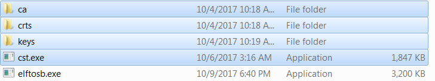

# Manufacturing process in Production phase

In production phase, the image requires to be signed and possibly encrypted. In this case, the device must be configured to HAB closed mode.

Assuming the PKI tree is ready for cst use, copy “ca”, “crts”, and “keys” folder and cst executable to the folder that holds the elftosb utility executable, as shown below

**Copy required key and certificates for signed image generation**



```{include} ../topics/generate_signed_imx_rt_bootable_image.md
:heading-offset: 3
```

```{include} ../topics/create_sb_file_for_fuse_programming.md
:heading-offset: 3
```

```{include} ../topics/create_sb_file_for_image_encryption_and_programmin.md
:heading-offset: 3
```

```{include} ../topics/create_signed_flashloader_image.md
:heading-offset: 3
```

```{include} ../topics/program_image_to_flash_using_mfgtool_001.md
:heading-offset: 3
```

**Parent topic:**[Example of complete manufacturing flow](../topics/example_of_complete_manufacturing_flow.md)

