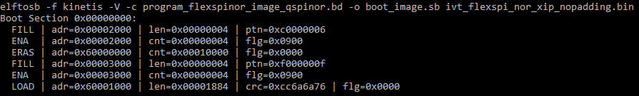

# Create SB file for Internal Flash programming

An example to generate the SB file for Internal Flash programming for RT1024-EVK board is shown as follows.

```
# The source block assign file name to identifiers
sources {
 myBinFile = extern (0);
}
constants {
    kAbsAddr_Start= 0x60000000;
    kAbsAddr_Ivt = 0x60001000;
    kAbsAddr_App = 0x60002000;
}
# The section block specifies the sequence of boot commands to be written to the SB file
section (0) {
    #1. Prepare Flash option
    # 0xc0233007 is the tag for Serial NOR parameter selection
    # bit [31:28] Tag fixed to 0x0C
    # bit [27:24] Option size fixed to 0
    # bit [23:20] Flash type option
    #             0 - QuadSPI SDR NOR
    #             1 - QUadSPI DDR NOR
    #             2 - HyperFLASH 1V8
    #             3 - HyperFLASH 3V
    #             4 - Macronix Octal DDR
    #             6 - Micron Octal DDR
    #             8 - Adesto EcoXIP DDR
    # bit [19:16] Query pads (Pads used for query Flash Parameters)
    #             0 - 1
    #             2 - 4
    #             3 - 8
    # bit [15:12] CMD pads (Pads used for command)
    #             0 - 1
    #             2 - 4
    #             3 - 8
    # bit [11: 08] fixed to 0
    # bit [07: 04] fixed to 0
    
    #
    \# In this example, the c0000053 represents:
    \#     HyperFLASH 1V8, Query pads: 8 pads, Cmd pads: 8 pads, Frequency: 133MHz
    load c0000053 > 0x2000;
    # Configure HyperFLASH using option a address 0x2000
    enable flexspinor 0x2000;
    #2 Erase flash as needed.(Here only 1MBytes are erased)
    erase 0x60000000..0x60100000;
    #3. Program config block
    # 0xf000000f is the tag to notify Flashloader to program FlexSPI NOR config block to the start of device
    load 0xf000000f > 0x3000;
    # Notify Flashloader to response the option at address 0x3000
    enable flexspinor 0x3000;
    #5. Program image
    load myBinFile > kAbsAddr_Ivt;
}
```

After the BD file is ready, the next step is to generate the boot\_image.sb file that is for MfgTool use later. Here is the example command:

**Example command to generate SB file for FlexSPI NOR programming**



After performing above command, the boot\_image.sb is generated in elftosb utility folder.