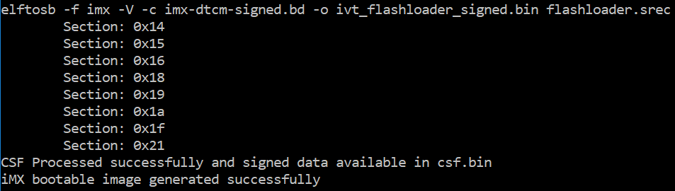

# Create signed Flashloader image

The BD file for signed Flashloader image generation is similar as the one in [Section 7.1.2.1 Generate signed i.MX RT bootable image](generate_signed_imx_rt_bootable_image.md).

The only difference is that the startAddress is 0x20208000 and IVTOffset is 0x400.

After the BD file is ready, the next step is to generate i.MX boot image using the elftosb utility. The example command is as below:

**Example command for Signed Flashloader image generation**

After the command “imx-ocram-signed.bd -o ivt\_flashloader\_signed.bin flashloader.srec” in the figure above, two bootable images are generated:

-   ivt\_flashloader\_signed.bin
-   ivt\_flashloader\_signed\_nopadding.bin

The first one is required by MfgTool for Secure Boot.