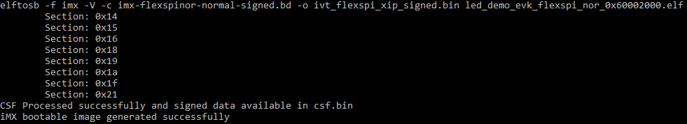

# Generate Normal Bootable Image

For example, in RT1024, the FlexSPI NOR memory starts from address 0x3000\_0000 and IVT from offset 0x1000. After following the steps in Section 4.2 \(*Generate unsigned normal i.MX RT bootable image*\) and BD file generation, here is the usage of the elftosb utility to create bootable image for FlexSPI NOR. All the BD files are provided in the release package. The figure below refers to the example command to generate a signed image.

**Example command to generate signed FlexSPI boot image**

After running above command, a file with suffix “\_nopadding.bin” is available into destination memory via subsequent SB file based on this binary.