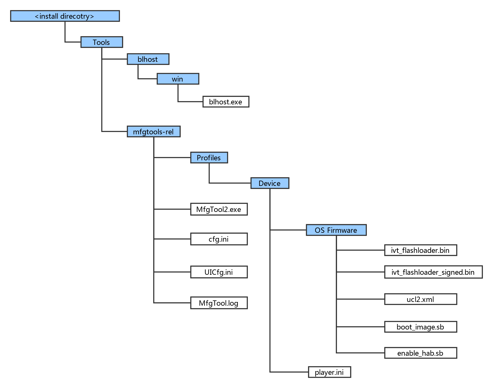
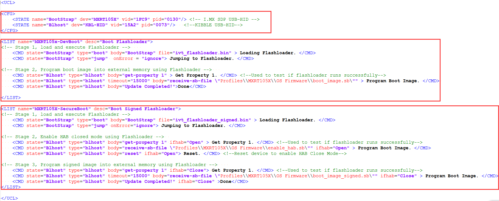

# MfgTool Directory structure

**MfgTool organization**



1.  In the release package, the mfgtools-rel folder appears in the tools folder along with blhost folder.
2.  The blhost.exe appears in the blhost/win folder and the MfgTools executable “MfgTool2.exe”.
3.  The Profiles folder contains the profile for the supported devices that include an “OS Firmware” folder and player.ini file.
4.  The ucl2.xml file in the OS Firmware folder is the main .xml file that MfgTool processes. It contains the manufacturing process flow for the device. The process includes identification parameters for the device and blhost commands parameter to identify the device connected to the PC host and a set of blhost commands required for updating the image. The ucl2.xml file can be customized to suit custom setup or manufacturing process flow. The folder contains example XML files for user’s reference. An example ucl2.xml is shown below. In general, it defines the supported states and lists.

    **Example UCL2.xml settings**

    

5.  The “ivt\_flashloader.bin” file under the “OS firmware” is the Flashloader released to support image programming.
6.  The “ivt\_flashloader\_signed.bin” file under the “OS firmware” is the bootable Flashloader image file generated by users for Secure Boot solution in production phase, it can be generated by following Section 4.3.
7.  The “boot\_image.sb” file under the “OS firmware” is the wrapped file with command sequences and bootable images generated by the users using the elftosb utility.
8.  The “enable\_hab.sb” file under the “OS firmware” is the wrapped file with command sequences that programs Fuses to enable HAB closed mode, which is generated by the users using the elftosb utility.
9.  The play.ini in the “Device” profile folder contains configurable parameters for the manufacturing tool application.
10. The cfg.ini and UICfg.ini files provide customizable parameters for the look and feel of the tool’s GUI. The cfg.ini in tool’s GUI is used to select “chip”, “platform” and “name” in list. Refer to the example below

    **Note:** Select appropriate “chip” from Device list, “name” from list in ucl2.xml in Device/OS Firmware folder.

    ```
    [profiles]
    chip = MXRT102X
    [platform]
    board =
    [LIST]
    name = MXRT102X-DevBoot
    ```

11. UlCfg.ini is used to select the number of instances supported by MfgTool UI. The valid instance range is 1-4.
12. The MfgTool.log text file is a useful tool to debug failures reported on MfgTool UI. The MfgTool logs the entire command line string which was used to invoke blhost and collects the output response text the blhost puts out on stdout into the MfgTool log file. The log file should be the considered first while troubleshooting.