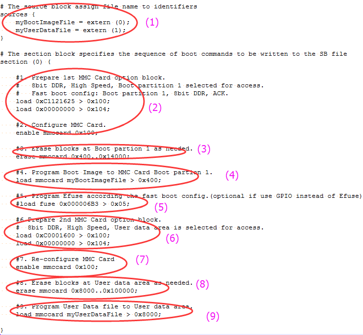

# Fast mode

There are nine steps in the BD file to program the bootable image to eMMC for Fast boot mode.

1.  The bootable image file path is provided in “sources” block.
2.  Prepare eMMC option block and enable eMMC access using “enable” command.
3.  Erase eMMC card memory as needed.
4.  Program boot image binary into eMMC.
5.  Program optimal eMMC boot parameters into Fuse \(optional, remove it if it is not required in actual project\).
6.  Prepare 2nd eMMC option block.
7.  Re-enable eMMC access using new option block.
8.  Erase data in User Data area as required.
9.  Load User Data file to User Data area.

**Example BD file for eMMC boot image programming for Fast boot mode**

The BD file for encrypted eMMC boot image and KeyBlob programming is similar to SD.