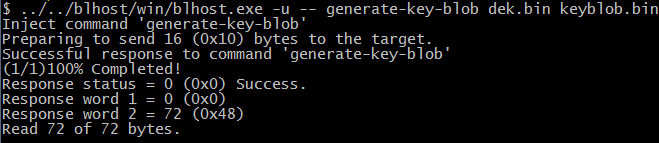
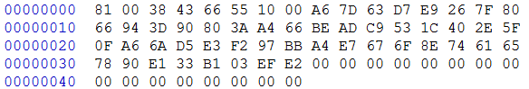
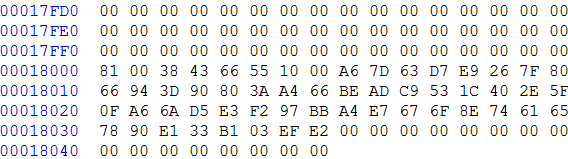

# Generate KeyBlob manually

Users may need to generate the KeyBlob manually in some cases. The Flashloader supports such usage with blhost.

The KeyBlob must be generated when the device works under HAB closed mode with signed Flashloader application.

Assuming the dek.bin is ready (*generated by the elftosb utility during encrypted image generation*). Here is an example command to generate KeyBlob block.

**Generate KeyBlob using the Flashloader**

After the command, “blhost.exe -u –generate-key-blob dek.bin keyblob.bin” in figure above is executed, a “keyblob.bin” file gets generated.

**Example KeyBlob**

With the encrypted image generated by the elftosb utility and keyblob.bin generated by the Flashloader, it is also feasible to combine the encrypted image and keyblob.bin. Then create a complete encrypted boot image with a Hex Editor. In this example, the KeyBlob offset is 0x18000 in the boot image.

The figure below is an example piece of encrypted image combined by Hex Editor.

**Create complete encrypted image using Hex editor**
