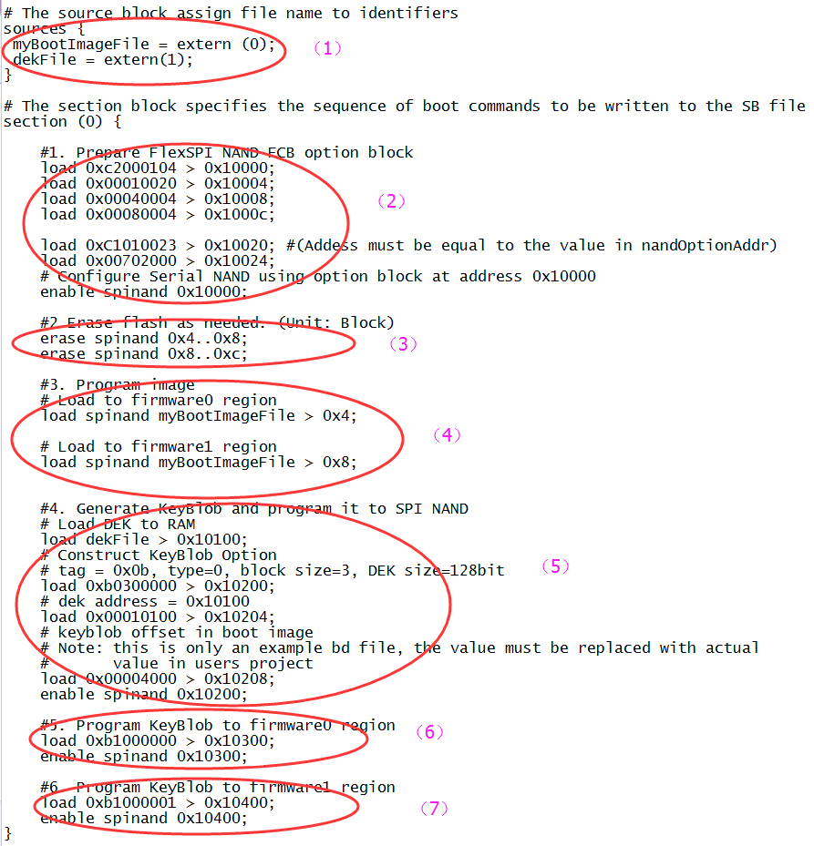

# Generate SB file for encrypted FlexSPI NAND Image and KeyBlob programming

Generally, the BD file for FlexSPI NAND image programming with KeyBlob consists of 7 steps.

1.  The bootable image file path is provided in sources block.
2.  Enable FlexSPI NAND access using FlexSPI NAND Configuration Option block.
3.  Erase SPI NAND device as needed.
4.  Program boot image binary into Serial NAND via FlexSPI module.
5.  Update KeyBlob information using KeyBlob Option block.
6.  Program KeyBlob block into SPI NAND for firmware 0.
7.  Program KeyBlob block into SPI NAND for firmware 1.

An example BD file is shown in the figure below.

|

|
