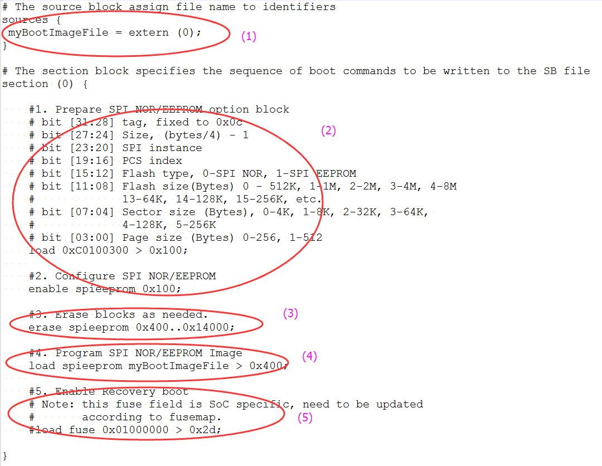

# Generate SB file for Serial NOR/EEPROM image programming

There are five steps in the BD file to program the bootable image to SD card.

1.  The bootable image file path is provided in sources block.
2.  Prepare Serial NOR/EEPROM option block and enable Serial NOR/EEPROM access using enable command.
3.  Erase Serial NOR/EEPROM memory as required.
4.  Program boot image binary into Serial NOR/EEPROM device.
5.  Enable Recovery Boot via Serial NOR/EEPROM as required.

An example is shown in the figure below.

**Example BD file for Serial NOR/EEPROM boot image programming**

The BD file for encrypted SPI EEPRM/NOR boot image and KeyBlob programming is similar to SD.
