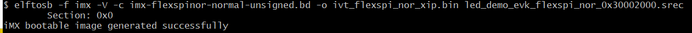

# Create image using the elftosb utility

To create a bootable image for a specific memory, users need to know the memory map of i.MX RT116x SoC. Details of generating bootable image can be found in Chapter 4. Here are the steps to create an i.MX RT bootable image for FlexSPI NOR using elftosb utility.

1. Create the BD file for boot image generation. The BD file content is showed below. It is also available in the release package in “&lt;sdk\_package&gt;/middleware/mcu-boot/bin/Tools/bd\_file/imxrt116xfolder

```
options {
    flags = 0x00;
    startAddress = 0x30000000;
    ivtOffset = 0x1000;
    initialLoadSize = 0x2000;
}
                entryPointAddress = 0x30002000;
sources {
    elfFile = extern(0);
}
section (0)
{
}
```

2. Create the i.MX RT bootable image using elftosb utility.

Here is the example command:

**Example command to generate FlexSPI NOR boot image**



-   ivt\_flexspi\_nor\_xip.bin
-   ivt\_flexspi\_nor\_xip\_nopadding.bin

The ivt\_flexspi\_nor\_xip\_nopadding.bin will be used to generate SB file for QSPI FLASH programming in subsequent section.